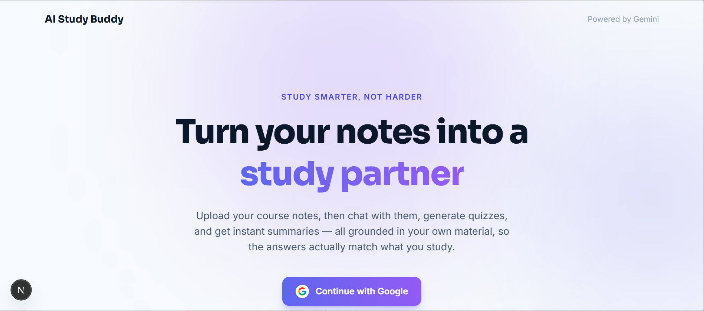
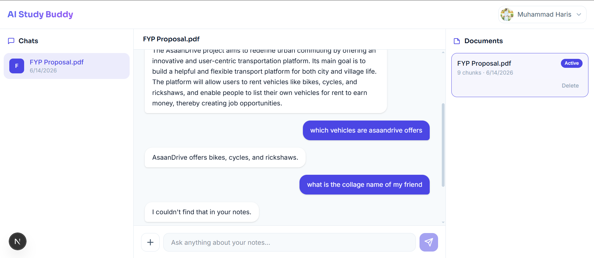
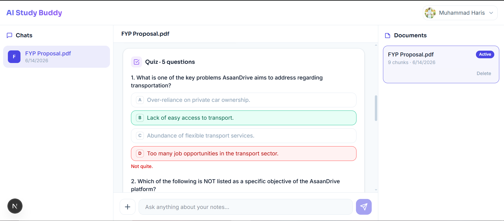
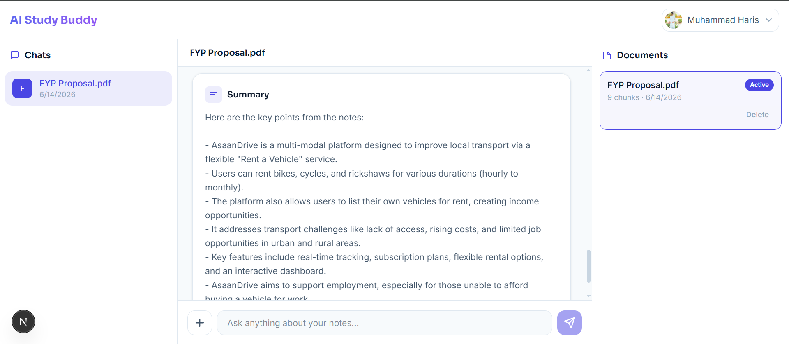

# AI Study Buddy

> Turn your own course notes into an AI study partner — ask questions, generate quizzes, and get summaries, all grounded in the material you uploaded.

[](https://ai-study-buddy-tawny.vercel.app)

**Live app:** https://ai-study-buddy-tawny.vercel.app

---

## Overview

Students study from their own notes — but a generic chatbot doesn't know *your* lecture slides, and it will happily make things up. **AI Study Buddy** fixes that by turning your uploaded notes into a private, grounded study assistant.

Upload a PDF of your notes and the app indexes them. From there you can:

- **Ask questions** and get answers drawn *only* from your notes (no hallucinated facts).
- **Generate quizzes** to test yourself on the material.
- **Get summaries** of the key points.

Everything is **grounded** in your own material and **scoped to your account** — each user only ever sees and queries their own documents. It's a full-stack, production-deployed application built around a Retrieval-Augmented Generation (RAG) pipeline.

---

## Live Demo & Screenshots

🔗 **[Open the live app →](https://ai-study-buddy-tawny.vercel.app)**

<!-- SCREENSHOTS: add your images to a `docs/` folder in the repo root, then they'll render below. -->

| Landing | Study workspace |
| :-----: | :-------------: |
|  |  |

| Quiz generation | Summary |
| :-------------: | :-----: |
|  |  |

---

## Key Features

- 🔐 **Google sign-in (Auth.js)** — OAuth login with database-backed sessions; all data is scoped per user.
- 📄 **Upload PDF notes** — text is extracted, cleaned, chunked, embedded, and stored automatically.
- 💬 **RAG-based Q&A** — answers are grounded in your own notes; if something isn't in them, the assistant says so instead of guessing.
- 📝 **Quiz generation** — auto-creates multiple-choice quizzes (4 options, one correct) from your material.
- 📌 **Summaries** — concise bullet-point summaries of a document's key ideas.
- 🕘 **Saved history per document** — chat turns, quizzes, and summaries are persisted and restored chronologically when you reopen a document.
- 📚 **Multi-document support** — manage a library of documents; switch between them, each with its own history.
- ✨ **Clean error handling** — friendly, design-matched toast notifications; raw API/internal errors are never shown to the user.

---

## Tech Stack

| Layer | Technology |
| --- | --- |
| **Framework** | Next.js (App Router) — server components, route handlers, server actions |
| **Language** | TypeScript |
| **Styling** | Tailwind CSS |
| **Database** | Neon (serverless PostgreSQL) |
| **Vector search** | `pgvector` (cosine similarity over 768-dim embeddings) |
| **ORM** | Prisma |
| **AI — embeddings** | Google Gemini `gemini-embedding-001` (768-dim) |
| **AI — chat / quiz / summary** | Google Gemini `gemini-2.5-flash` |
| **Auth** | Auth.js (NextAuth v5) with Google OAuth + Prisma adapter (database sessions) |
| **Hosting** | Vercel |

---

## How the RAG Works

The whole point is **grounding**: the model answers from *your* notes, not from the open internet.

**1. Ingestion (on upload)**
```
PDF → extract text → normalize & chunk (~800 chars, ~100 overlap)
    → embed each chunk with Gemini (RETRIEVAL_DOCUMENT, 768-dim)
    → store chunks + vectors in Postgres (pgvector column)
```

**2. Retrieval & answering (on a question)**
```
question → embed (RETRIEVAL_QUERY, 768-dim)
        → pgvector cosine search for the top-5 most similar chunks
          (filtered to the signed-in user + selected document)
        → inject those chunks into the Gemini prompt as context
        → grounded answer (or "I couldn't find that in your notes.")
```

The retrieval query runs as parameterized SQL using pgvector's `<=>` cosine-distance operator, and the ownership filter (`Document.userId = <you>`) is enforced **inside the query** so users can never match another account's chunks.

> **Quizzes and summaries** work slightly differently: instead of searching for a single question's context, they gather chunks spanning the **whole document** (evenly sampled and capped for cost) so the output covers the full set of notes. All generation uses strict grounding instructions, and quizzes use Gemini's JSON mode for a reliable, parseable shape.

---

## Running Locally

### Prerequisites
- Node.js 18+
- A [Neon](https://neon.tech) PostgreSQL database
- A [Google AI Studio](https://aistudio.google.com) API key (Gemini)
- A Google OAuth client (for sign-in) from the [Google Cloud Console](https://console.cloud.google.com)

### 1. Clone & install
```bash
git clone https://github.com/MuhammadHarisBaloch/ai-study-buddy.git
cd ai-study-buddy
npm install
```

### 2. Environment variables
Create a **`.env.local`** file in the project root with the following variables (names only — fill in your own values; never commit this file):

| Variable | Description |
| --- | --- |
| `DATABASE_URL` | Neon **pooled** connection string — used by the running app |
| `DATABASE_URL_UNPOOLED` | Neon **direct** connection string — used by Prisma for migrations |
| `AUTH_SECRET` | Secret used by Auth.js to sign/encrypt sessions (generate with `npx auth secret`) |
| `AUTH_GOOGLE_ID` | Google OAuth client ID |
| `AUTH_GOOGLE_SECRET` | Google OAuth client secret |
| `GEMINI_API_KEY` | Google Gemini API key (embeddings + generation) |

> `DATABASE_URL` is the host **with** `-pooler`; `DATABASE_URL_UNPOOLED` is the same host **without** it. In your Google OAuth client, add `http://localhost:3001/api/auth/callback/google` as an authorized redirect URI for local sign-in.

### 3. Enable pgvector on Neon
In the Neon SQL Editor (or any `psql` session against your database), run:
```sql
CREATE EXTENSION IF NOT EXISTS vector;
```

### 4. Apply the database schema
```bash
npx prisma migrate dev
```

### 5. Run the dev server
```bash
npm run dev
```
The app runs at **http://localhost:3001**.

---

## What I Learned / What's Next

This was my first end-to-end **RAG** project, and building it took me well beyond CRUD into the full stack:

- **Retrieval-Augmented Generation in practice** — chunking strategy, embedding text into a shared vector space, and the difference between *query* and *document* embeddings. I learned that **grounding is mostly prompt + retrieval discipline**, not model magic: tight system instructions plus good top-K retrieval are what keep answers honest.
- **Vector search in a real database** — modeling a `pgvector` column with Prisma (including dropping to raw SQL where the ORM can't represent vectors) and reasoning about cosine distance.
- **Auth & multi-tenancy** — wiring Auth.js with database sessions and enforcing per-user data isolation at the query level, not just the UI.
- **Production concerns** — serverless-safe PDF parsing, environment/secret management, never leaking raw errors to users, and the realities of deploying to Vercel with a serverless Postgres.

**What's next:**
- Stream responses token-by-token for a more responsive chat.
- Support more file types (DOCX, plain text, pasted notes) and larger documents.
- Show source citations — highlight *which* chunks an answer came from.
- Save quiz attempts and track scores over time for spaced-repetition style review.
- Add automated tests around the retrieval and grounding logic.

---

*Built by [Muhammad Haris](https://github.com/MuhammadHarisBaloch).*
